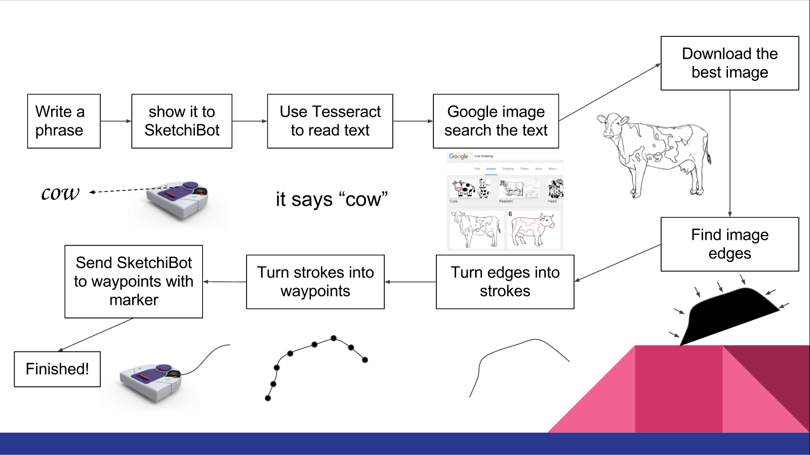

# Sketchibot

##### Alex Crease, Jay Woo, Kai Levy

### Computational Robotics Fall 2015 Final Project: Seeing and Drawing Robot

## Description
Sketchibot is a seeing and drawing robot. It attempts to play a 'pictionary'-like game, where the user writes down a prompt for it. It reads the prompt and then proceeds to draw its interpretation of the prompt, using the Bing Search API, OpenCV's canny edge detection & contour finding, and various filtering methods.

For more information about our project and our process, see the project stories included in `/stories`

## Prerequisites
- Marker attachment on the Neato
- Installation on the raspberry pi of the scripts included in `bot_files`
  - Modification of `/etc/rc.local` to run the scripts at startup:

    `echo "sudo ~pi/sketchibot/servo_server.py &" >> /etc/rc.local`

- Addition of the following code to `bringup_minimal.launch` in `neato_node`
```
<node name="marker_node" pkg="sketchibot" type="servo_client.py" output="screen">
  <param name="host" value="$(arg host)" />
</node>
```
- [Bing API Key](http://www.bing.com/toolbox/bingsearchapi), stored as an the environmental variable `BING_API_KEY`
- [OpenCV](https://help.ubuntu.com/community/OpenCV)
- Numpy and its dependencies
  - `apt-get install python-numpy`
- Tesseract OCR and pytesseract
  - `apt-get install tesseract-ocr`
  - `pip install pytesseract`
- Hunspell
  - `apt-get install libhunspell-dev`
  - `pip install hunspell`

## Usage
- Connect to the Neato
  - `roslaunch neato_node bringup.launch host:=[ip of robot]`
- Launch the script
  - `roslaunch sketchibot sketchibot.launch`

## System Architecture
Sketchibot's work flow requires the coordination of a number of different modular parts described below.



### Text Reading
`scripts/text_read.py`

This script provides the text prompts for Sketchibot based off of the user's writing. It uses Tesseract OCR to recognize text, and runs as a ROS node that listens to `camera/image_raw`. Tesseract runs against the camera's image and stores the received value. Once the same string has been received consecutively for a certain number of times, it is sure as to what the reading is. Because Tesseract doesn't work very well on handwriting, we use Hunspell to correct any errors that could arise from Tesseract and make sure that the query we pass out is English.

### Image Searching
`scripts/image_search.py`

Once we have received a reading of what the user is prompting for Sketchibot, we need find what it will attempt to sketch. To do this, we use Bing's Search API. The ImageSearcher object sets up the required authentication and endpoints, and allows us to make a query with it's `find_image`. This takes optional parameters, such as how many results to retrieve, how many results to skip, and what filters to use. It makes the request and then directly retrieves the images at the given urls, appends them into a list and sends them out for edge detection.

### Edge Detection
`scripts/edge_detect.py`

With the search results for our prompt, we need to analyze their edges to see which ones could be reasonably sketched. To do this, the EdgeDetector runs canny edge detection on a given image, using adaptive thresholding from Otsu's method. This yields an image where the bright pixels are edges, so we must next run contour finding in order to turn them into whole strokes that a Neato can execute. This is done with another OpenCV function-- but that yield contours on either side of an edge. To correct this, we filter out all of the 'holes' as opposed to 'objects'. Then, we attempt to optimize the order of the contours by using a minimum-distance algorithm: from the end of each stroke, we proceed to the closest start of the next stroke. This sorted array is ready to be passed onto filtering.

### Contour Filtering

### Navigation
`scripts/navigation.py`

In order to detect the Neato's current position, the gmapping package is used to estimate a path for the robot the follow. For the first waypoint of each stroke, Sketchibot travels to the target location with the pen up. For each subsequent waypoint in the stroke, the marker is lowered and lines are drawn onto the page. It is important that suitable walls or markers are placed around the edges of the canvas, so that an accurate occupancy grid can be produced. Additionally, the laser scanner is only accurate up to a particular range, so it is also important to consider the strength of the LIDAR signal when the Neato is far away from all of its surroundings.

### Main Program
`scripts/sketchibot.py`

This script runs all of the major components as in the flow diagram specified above. After executing the `roslaunch` command, this program takes care of everything else!

## Future Work
