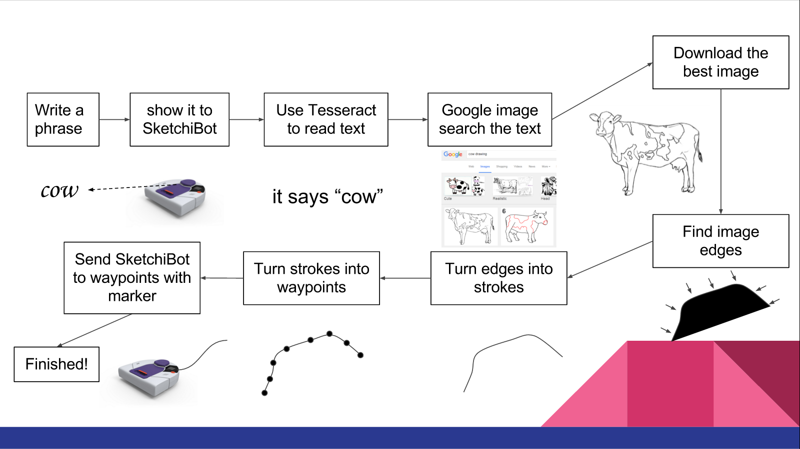
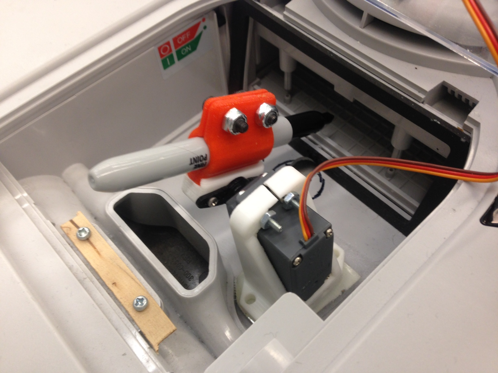
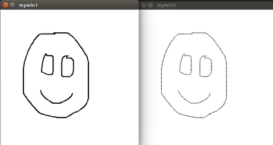

# SketchiBot: Current Progress
#### Comp Robo Fall 2015
#### Alex Crease, Jay Woo, Kai Levy

Hey all,
We are team Sketchibot, a team of three working with Neato's for our Computation Robotics class, aiming to create a drawing robot!

## The Goal
Simply put, our goal is to get the Neato to draw images inspired by visually-received, text-based prompts. That is, the robot will see a written prompt on it's camera. It will interpret that prompt and scour the web for an appropriate image, which it will then draw by moving around on a large piece of paper.

## Project Workflow

## Progress So Far

### The Marker
In order to draw with our Neato, we needed to attach some drawing device. We went about this by first drilling a hole through the center of our devoted Neato, dubbed Sketchibot.

Then, we attached a marker to a 3-D printed part that Alex designed, which mounted to a Servo that is wired into the Raspberry Pi that controls the Neato.

At this point, with the help of Paul, we interfaced into the Raspberry Pi and created a file that would control the Servo with PWM, adapted from [here](http://www.toptechboy.com/raspberry-pi/raspberry-pi-lesson-28-controlling-a-servo-on-raspberry-pi-with-python/). This script also included a simple server that we would be able to connect to from our computers. With that, we were able create a ROS node that would connect to the Pi server upon connecting to a Neato, and would continually listen to the ROS topic, `/servo_command`, causing the marker to actuate up and down. It was successful, and we were able to draw things by manually driving the robot and the marker!

### Path Planning
Once we had an actuating marker, we started tackling the process of planning a path for the Neato to draw things. Our first test was the Neato drawing a square, simply adapting an odometry-based square-driving program that we had made for a previous assignment. Click the image below to check it out!

That worked, but it wasn't very robust or particularly precise. So we decided to examine techniques with setting waypoints for the robot via ROS's built-in navigation stack, using a map to keep track of it's own position. By using the 'move_base' node, it is possible to publish goals for the robot to travel to, and the node will automatically publish commands to /cmd_vel to drive the Neato along path to the waypoint. Theoretically, the points of the image can be passed to the goal topic in the 'move_base' node, and the Neato will try its best to go to each of the individual points.

However, the results, which can be viewed below, were less than stellar. Although the Neato reaches all of its individual goals with little error, the path-planning algorithm is sub-optimal. The overshoot is compensated for by turning the Neato around a full 180 degrees in order to get back to the waypoint location, producing much uglier images.

Given this shortcoming, we've looked into more robust solutions. Using an IMU, the odometry data can be vastly improved to account for wheel slippages. By Kalman filtering the IMU data, the heading can be approximated much more accurately, which could really help with pointing the robot towards the next waypoint location. As for getting the position of the Neato, we could continue using our SLAM and particle filter code and possibly fuse that data with the IMU-corrected odometry readings to improve location tracking.

### Edge Detection and Contour Finding
We played around a bit with ways to convert our target images into drawable commands, and decided to try using Canny Edge Detection to find the most important edges to draw in order to get a good rendering of the image. This operation is built into OpenCV, and was fairly straightforward to get start on. Once we grey-scaled our target image, we simply ran the operation in order to get our a binarized image of the edges.

From here, we tried using OpenCV's contour finding to break these edges into strokes. After playing with the parameters, we got some pretty good results on our trial images!

The resultant data structure came out as a list of lists, where each inner list is a contour, and each contour a list of points. In essence, a collection of strokes in 'connect-the-dots' form. We noticed however that the strokes weren't ordered very logically, and would often jump around, which would be very inefficient for our robot. Additionally, a few times multiple strokes covered the same edges on the image-- we plan on exploring methods of pre-filtering to cut down on these inefficiencies.

### Command Planning and Virtual Interface

In order to command the robot to draw an image, we need to send the Neato a series of waypoints that it would have to get to with the marker down. We created a drawing test and visual interface to format the waypoints nicely. In this interface, you can sketch out a path or series of paths on screen with a "page" proportional to the size of the actual paper size the Neato will be drawing on. Each path consists of a series of waypoints, and all of the waypoints are scaled up to the actual dimensions the Neato works in (meters). Once the scaling is performed, the paths undergo two filtration methods: one in which waypoints within a certain distance from prior waypoints are filtered out, and one in which waypoints within a certain angle tolerance are filtered out. The final "directions" for the Neato consist of a single array of paths, each path being an array of waypoint coordinates. The image below shows a series of drawn paths, on the left, and a corresponding plot of filtered waypoints corresponding to that path on the right.

## Decisions Going Forward
Moving forwards, the main goal we would like to tackle first is integration. Currently, we have three major components that need to be integrated into one system:
* Converting an image into a series of contours using Canny edge detection
* Converting the points in each contour into a series of waypoints
* Telling the Neato to go to each of the waypoints
Hopefully, we can get an initial test of our complete system running!

In addition to integration, we will need to improve each of the subsystems to get better performance. The Canny edge detection may need more tuning, and we will probably also explore different path filtering methods to enable the robot to draw smarter and faster. We are hoping to look into certain algorithms to prioritize certain strokes over others, and given that the Neato must move to each point in each contour, this is essentially a Traveling Salesman problem. Finally, the IMU needs to be integrated into the overall system to improve the Neato's sensor capabilities and to improve the localization behavior.

Generally speaking, we feel we're in a pretty good spot, and if we have some spare time in the following 3 weeks, we might look into the Tesseract package in more detail!