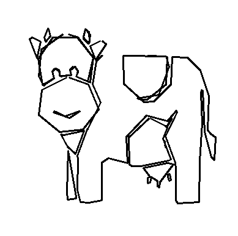

# SketchiBot: Progress Report 2
#### Comp Robo Fall 2015
#### Alex Crease, Jay Woo, Kai Levy

Hey all,
We are team Sketchibot, a team of three working with Neato's for our Computation Robotics class, aiming to create a drawing robot!

## The Goal
Simply put, our goal is to get the Neato to draw images inspired by visually-received, text-based prompts. That is, the robot will see a written prompt on it's camera. It will interpret that prompt and scour the web for an appropriate image, which it will then draw by moving around on a large piece of paper.

## Project Workflow

## Progress So Far

### Previously...

If you aren't up to date on what we're doing and what we did already, check out our first progress report [here](https://github.com/kailevy/sketchibot/blob/master/stories/story1.md)!

### Text Processing

### Image Searching

### Waypoint Filtering and Generation

After the robot finds a suitable image, it finds the contours for that image as discussed in [Project Report 1](https://github.com/kailevy/sketchibot/blob/master/stories/story1.md). The below GIF uses OpenCV's Canny edge detection to find edges in the image and plot them.

The output of this is a list of paths, with each path definining a "stroke" containing a list of x and y points that make up the stroke. At this point, we implemented a function that sorts the strokes such that the quickest path can be taken to get from the end of one stroke to the beginning of another. 

[//]: # (Kai talk about traveling salesman stuff here)

After the sorting is performed, the list of strokes gets sent to a waypoint filtering and scaling class, which performs the following steps:

1. Determines the scaling factor between the paper size (what the robot is drawing on) and the image size
2. Scales up the image contours using that scaling factor
3. Filters out the points based on how close they are to one another and how large of an angle 3 points form.
4. Centers the points in the page.

To determine the scaling factor, the method looks as the aspect ratio of the image and of the page, and then scales the image so that it will fit within the limits of the page, with some margin. Once all of the contours are the right units, they get filtered based on how accurate we want the Neato to be. The code looks through each point in each stroke, and for each set of two eliminates points that are under a certain distance apart. For each set of three, it calculates the angle the three make and eliminates the middle point if the angle is within a certain range of 180 degrees. The function performs both of these filtration methods simultaneously with the "and" boolean operator, so if there are three points that form a sharp angle but are within the minimum distance, the middle point stays because the angle is sharp enough to make a difference although the distance is not. Using this method, we can filter our waypoints down but still keep the drawing recognizeable.

  |  

Once the filtration is done, the script centers the drawing in the center of the page before sending the waypoint coordinates off to the Neato so that it can actually draw out the strokes.
 
### Path Planning

### Integration

## Decisions Going Forward