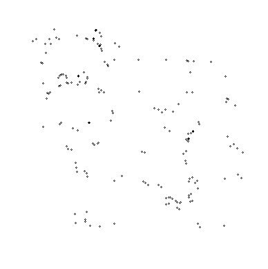

# SketchiBot: Progress Report 2
#### Comp Robo Fall 2015
#### Alex Crease, Jay Woo, Kai Levy

Hey all,
We are team Sketchibot, a team of three working with Neato's for our Computation Robotics class, aiming to create a drawing robot!

## The Goal
Simply put, our goal is to get the Neato to draw images inspired by visually-received, text-based prompts. That is, the robot will see a written prompt on it's camera. It will interpret that prompt and scour the web for an appropriate image, which it will then draw by moving around on a large piece of paper.

## Project Workflow

## Progress So Far

### Previously...

If you aren't up to date on what we're doing and what we did already, check out our first progress report [here](https://github.com/kailevy/sketchibot/blob/master/stories/story1.md)!

### Text Processing
These past few weeks, we have tackled text recognition. The point of having our Neato recognize text is to have an interactive drawing experience, where the user writes a desired sketch on a white board, for the robot to interpret and then sketch. We were able to implement it successfully, using Tesseract OCR and pytesseract, a python wrapper for it. The recognizer listens in on the `image/raw` topic, and stores any text it recognizes. Once it has seen the same text for enough consecutive frames, it decides to pass that along as the prompt. Because Tesseract is not perfect --especially for handwriting--- we account for potential errors by passing our prompt through the hunspell spell-checker.

### Image Searching
Once we have recieved a prompt and ensured that it is English, we have the robot 'interpret' that prompt-- by searching the web. Using the Bing API, we search for images with the given prompt as well as 'clip art', and apply a medium size filter. We parse the results for the direct URLs to the images, download them, and pass them along to the edge detector.

### Waypoint Filtering and Generation

After the robot finds a suitable image, it finds the contours for that image as discussed in [Project Report 1](https://github.com/kailevy/sketchibot/blob/master/stories/story1.md). The below GIF uses OpenCV's Canny edge detection to find edges in the image and plot them.

The output of this is a list of paths, with each path defining a "stroke" containing a list of x and y points that make up the stroke.

At this point, we implemented a function that sorts the strokes such that the quickest path can be taken to get from the end of one stroke to the beginning of another. We achieved this by framing the traversal across all the strokes as a traveling salesman problem: How can the Neato paint every strokes, while minimizing the amount of empty space it travels on? We decided to use a minimum-distance solution to this, meaning that at the end of each stroke, the robot would next go to the closest point that was the start of another stroke. While this doesn't find the most efficient solution (the robot is still a little wasteful in it's traversal), it is fast and simple.

After the sorting is performed, the list of strokes gets sent to a waypoint filtering and scaling class, which performs the following steps:

1. Determines the scaling factor between the paper size (what the robot is drawing on) and the image size
2. Scales up the image contours using that scaling factor
3. Filters out the points based on how close they are to one another and how large of an angle 3 points form.
4. Centers the points in the page.

To determine the scaling factor, the method looks as the aspect ratio of the image and of the page, and then scales the image so that it will fit within the limits of the page, with some margin. Once all of the contours are the right units, they get filtered based on how accurate we want the Neato to be. The code looks through each point in each stroke, and for each set of two eliminates points that are under a certain distance apart. For each set of three, it calculates the angle the three make and eliminates the middle point if the angle is within a certain range of 180 degrees. The function performs both of these filtration methods simultaneously with the "and" boolean operator, so if there are three points that form a sharp angle but are within the minimum distance, the middle point stays because the angle is sharp enough to make a difference although the distance is not. Using this method, we can filter our waypoints down but still keep the drawing recognizeable.

 

Once the filtration is done, the script centers the drawing in the center of the page before sending the waypoint coordinates off to the Neato so that it can actually draw out the strokes.

### Path Planning
Localization and path planning has changed quite a bit from the previous rendition in that waypoints are no longer published to the /move_base node. Instead, the Neato localizes itself using the gmapping SLAM algorithm and manually travels to waypoints in each contour. After receiving the filtered list of waypoints, the Neato rotates itself until it is facing the new waypoint. Then, it moves forwards with proportional linear and angular velocity control until it gets within a certain distance from the target. This process is repeated for each point in the list. The pen attached to the servo moves up after completing a contour and moves down again when a new contour is being drawn.

The result in the above image was from a previous version of the code that used Hector SLAM, which ended up being fairly inaccurate for position data. With gmapping, we will hopefully be able to drive the Neato at higher velocities, without sacrificing too much accuracy, and we will soon be testing out this new version of the code to see if the path planning runs smoothly!

### Integration
In addition to developing these major components, we also worked on getting the pieces integrated into a cohesive system. We now have an overarching file called sketchibot.py that calls functions and instantiates objects from other files, and as a result, everything now flows in a very linear fashion. Though there are couple of kinks that need to be worked out to get everything running properly, we mainly need to run a couple of tests by having the Neato draw something.

## Decisions Going Forward
Given the limited time window we have left, we don't have too many major plans moving forwards. There are a couple of minor additions that could be made to the code. For instance, we are planning on having a UI that displays each of the paths that the Neato has already visited. Additionally, we may explore different filtering or contour processing methods in order to eliminate duplicate contours.

Aside from these additional features, we would like to finalize the code sometime soon. If the integration goes smoothly, we could potentially focus on understanding some of the inner workings of the packages that we are using for our project, including gmapping and Tesseract. Overall, we think we're making some great progress!
